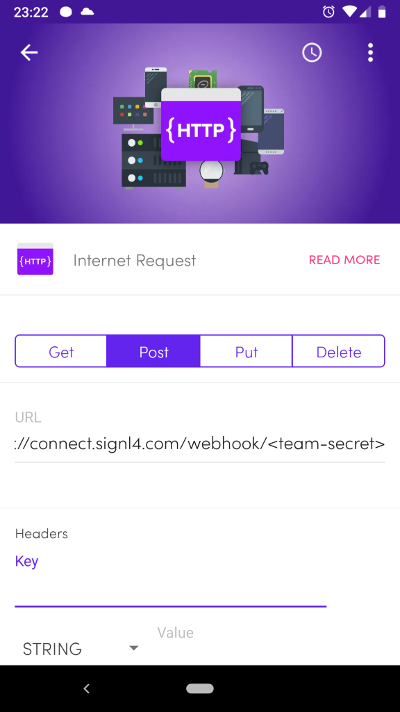

# Mobile alerting with tracking & escalation at the push of a Flic button

## Why SIGNL4

Flic buttons (https://flic.io), provide a quick and simple possibility to trigger any kind of action at a push of a button. The button connects to the Flic hub or to an android phone via low-energy Bluetooth. Pairing one or more Flic buttons with SIGNL4 can enhance your daily operations with an extension to your mobile team in the field or on the shop floor.
 

## How it Works

All it takes to pair the Flic button and SIGNL4 is the Flic button, SIGNL4 and an Android phone with the Flic app (or optionally the Flic hub).

The setup is super easy and you can integrate and get your first alert in less than 15 minutes.

Integration Capabilities
- Manual alerting at a click of a button
- Service engineers alerted via mobile push, text and voice
- Staff can acknowledge and take ownership for critical events that occur
- Alerts are escalated in case of no response
- Communicate within an alert to address a particular problem
- Different alert states per button, e.g. long-press to communicate an OK again
 
Scenarios
- DevOps
- Industry 4.0
- Service dispatching
- Security
- House care
- Manufacturing, Utility, Oil and Gas, Agriculture, etc.
 
## Hot to integrate
 
### Integrating SIGNL4 with the Flic Button
 
In our example we use one Flic button to notify a team of service engineers about needed assistance on-site.

SIGNL4 is a mobile alert notification app for powerful alerting, alert management and mobile assignment of work items. Get the app at https://www.signl4.com.

Flic is a wireless (Bluetooth) button adaptable to almost any use case or application. It is combines reliability, security and speed. Find out more at https://flic.io.

### Prerequisites
A SIGNL4 (https://www.signl4.com) account
Access to the Google Cloud Platform (https://console.cloud.google.com)
A Flic button (https://flic.io)
An Android phone and the Flic app (https://play.google.com/store/apps/details?id=io.flic.app)
Alternatively to the Android app you can also use the Flic Hub (https://flic.io/flic-hub)

### Integration Steps

For setting up the Flic button for SIGNL4 alerting the following steps are required.

#### The SIGNL4 App
If not already available, download the SIGNL4 app for Android (https://play.google.com/store/apps/details?id=com.derdack.signl4) or iOS (https://itunes.apple.com/de/app/signl4-mobile-alarmierung/id1100283480?mt=8), register and invite your team members.

#### Pair your Flic Button with your Android Phone

Get the Flic Android app and pair your Flic button with the app.

Alternatively you can also use the Flic Hub: https://www.youtube.com/watch?v=YpfHPP9VQ8M

#### Configure your Actions in the Flic App

Now you can configure what shall happen if someone presses (or long-click, or double-click) the Flic button.

 

In the Flic app, select Internet Request and then choose HTTP Post.

As URL you enter your SIGNL4 REST API URL including the team secret.

The Body is any JSON you would like to pass as alert notification.

And the Content Type is application-json (application/json).

This is it.

### Test it

Now you can press the button and the SIGNL4 HTTP request is triggered. You will then receive the notification on your phone.
